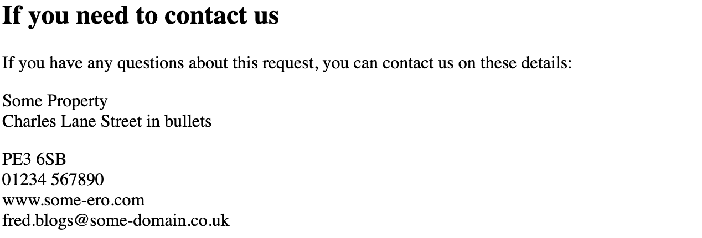

# GOV.UK Notify Templates

Notification API provides a proxy to the [UK Government Notify service](https://www.notifications.service.gov.uk/), 
which handles the sending of various communications by email, text or letter. The full documentation on the service can 
be found [here](https://www.notifications.service.gov.uk/using-notify/api-documentation).

Once you have been given access to GOV Notify, you will be able to see the templates that are already defined, edit 
them and create new ones. 

The template ids are referenced by Notifications API via environment variables set in the infra repo and mapped to 
properties in `application.yml`.

_**Please be aware that templates for live services are stored on the site!**_

## Template Versioning

Template versioning is not currently supported by GOV Notify, and templates can only be created through their website's
UI. In order to allow for control over template changes, especially when breaking changes are introduced, all 
templates should include a version number in their name e.g.

    Rejected Documents Email - EN - v1.0

When a template requires a breaking change (e.g. addition of a new placeholder), then a new copy of the template should
be created and the version number incremented. This allows for controlled rollout as we can switch to the new template
after the required service changes have already been deployed.

## Formatting templates

Notify Service templates support following formatting options:

    To put a title in your template, use a hash:
    # This is a title
    ## This is a subtitle (there is no difference to normal text for letters)

    To make bullet points, use asterisks (sub-bullet points have two spaces before the asterisk):
    * point 1
    * point 2
      * subpoint 2.1
      * subpoint 2.2
    * point 3
      
    To add inset text, use a caret:
    ^ You must tell us if your circumstances change

    To add a horizontal line, use three dashes:
    First paragraph
    ---
    Second paragraph

Note that you **cannot** bold text.

[Documentation on formatting](https://www.notifications.service.gov.uk/using-notify/formatting#bullets)

## Placeholders

Placeholders are denoted with double brackets in the templates `((example))`. Adding the key `example` to the 
personalisation dictionary will insert `example`'s value into the generated template in place of ((example)).

### Missing Placeholders

Requesting a template preview or attempting to send a notification without a placeholder causes the Notify service to 
return a 400 Bad Request with response body:

    {
        "timestamp": "2022-12-22T11:20:51.681Z",
        "status": 400,
        "error": "Bad Request",
        "message": "Status code: 400 {\"errors\":[{\"error\":\"BadRequestError\",\"message\":\"Missing personalisation: missingPlaceholder\"}],\"status_code\":400}\n"
    }

You can, however, send the empty string for a placeholder you do not wish to appear in the template (e.g. for optional
text). This will create an empty line as shown in the example request and output below:

    Template includes ERO Address as:
    ((eroAddressLine1))
    ((eroAddressLine2))
    ((eroAddressLine3))
    ((eroAddressLine4))
    ((eroAddressPostcode))
    
    Request sent to Notify service includes blank values like:
        "address": {
            "property": "Some Property",
            "street": "Charles Lane Street in bullets",
            "town": "",
            "area": "",
            "postcode": "PE3 6SB"
        }

Note that insets are still rendered if an empty string is provided, so use them sparingly.

### Extra Placeholders

Requesting a template preview or sending a notification with a placeholder that is not used in the template does not 
cause any validation errors. This could be useful if we ever need to edit an existing template with new placeholders; 
we can send the placeholder in advance and then update the template.

### Placeholder Markup

Markup within placeholder values is supported and changes the rendered HTML. Generally formatting would be expected 
to be part of the template and not the placeholders. 

## API Details
### Template Preview - Notification API Response

Notifications REST API has an endpoint described in Open API as:

    POST /templates/{templateType}/preview
    
    Valid template types are: application-received, application-approved, application-rejected, photo-resubmission
    
    Request includes an optional personalisation map containing template placeholder values, for example:
    {
        "personalisation": {
            "name": "Fred",
            "surname": "Blogs"
        }
    }
    
    Response includestext*string
    example: Hi Fred Blogs,Text preview of the template with personalisation datasubjectstring
    example: Fred Blogs photo resubmissionPreview of the subject with personalisation data, if the template supports subject fieldhtmlstring
    example: 
Hi Fred Blogs,
Html preview of the template with personalisation data, if the template supports html format

### Sent Message - Notification API Available Data

Notify send an email API returns a SendEmailResponse that is stored in the DynamoDB along with details of the request including personalisation contents.

    {
        "id": "5d2e3fb6-edea-4d71-a78d-70e8e08d6bc8",
        "channel": "EMAIL",
        "gssCode": "E99999999",
        "notifyDetails": {
            "body": "Dear Neil\r\n\r\n# Application Reference JIRA-EIP1-1942-Test-For_Joshua\r\n\r\nIn reference to application reference JIRA-EIP1-1942-Test-For_Joshua, we need you to send us a new or updated photo.",
            "fromEmail": "electoralregistrationofficerportal@notifications.service.gov.uk",
            "notificationId": "3d755bb0-dfb2-4c0c-be90-a15fa1a2c8a3",
            "reference": "5d2e3fb6-edea-4d71-a78d-70e8e08d6bc8",
            "subject": "New Photo request for Application Reference JIRA-EIP1-1942-Test-For_Joshua",
            "templateId": "f1571006-c3a0-4c97-884a-189f5b103f85",
            "templateUri": "https://api.notifications.service.gov.uk/services/137e13d7-6acd-4449-815e-de0eb0c083ba/templates/f1571006-c3a0-4c97-884a-189f5b103f85",
            "templateVersion": 1
        },
        "personalisation": {
            "applicationReference": "JIRA-EIP1-1942-Test-For_Joshua",
            "firstName": "Neil"
        },
        "requestor": "neil.massey@valtech.com",
        "sentAt": "2022-10-18T08:31:37.425500319",
        "sourceReference": "JIRA-EIP1-1942-TestJoshua",
        "sourceType": "VOTER_CARD",
        "toEmail": "neil.massey@valtech.com",
        "type": "PHOTO_RESUBMISSION"
    }

It should be noted that **ALL** the details returned from the Notify service are included in the above item, the Java client response object has properties:

    public class SendEmailResponse {
    private final UUID notificationId;
    private final String reference;
    private final UUID templateId;
    private final int templateVersion;
    private final String templateUri;
    private final String body;
    private final String subject;
    private final String fromEmail;
    ...
    @Override
    public String toString() {
    return "SendEmailResponse{" +
            "notificationId=" + notificationId +
            ", reference=" + reference +
            ", templateId=" + templateId +
            ", templateVersion=" + templateVersion +
            ", templateUri='" + templateUri + '\'' +
            ", body='" + body + '\'' +
            ", subject='" + subject + '\'' +
            ", fromEmail=" + fromEmail +
            '}';
        }
    }

All request placeholders are saved, as is the templateId used, so would be possible to generate a preview for a 
notification that has been sent.